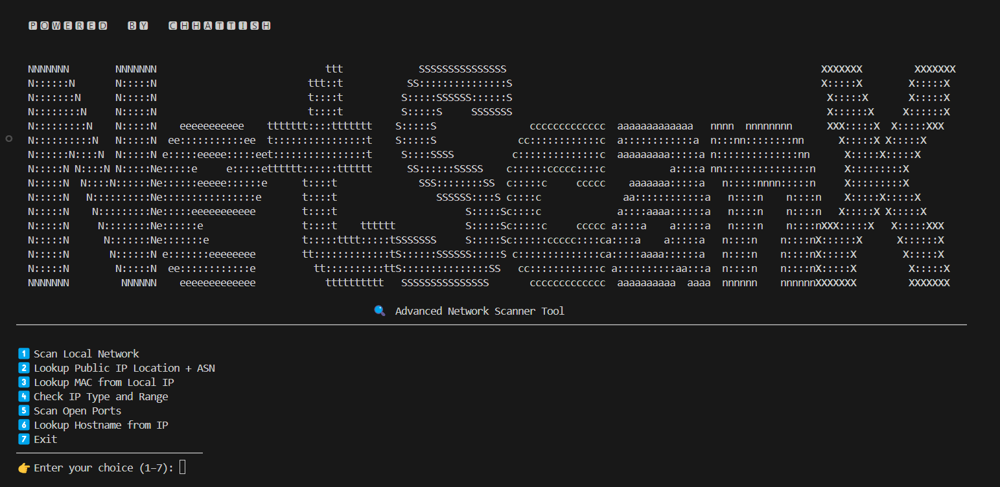

# 🔍 NetScanX

**NetScanX** is an advanced Python-based network utility tool designed for ethical hackers, cybersecurity learners, and network adminstrators.  
It offers multiple powerful network reconnaissance features into a single, clean terminal interface.

🏷️ **Version:** v1.0.0  
📅 **Status:** Stable Release




## 🚀 Features

- 📱 Local Network IP & MAC Scanner  
- 🍿 MAC Vendor Lookup  
- 🌍 Public IP Location + ASN Info  
- 🔎 VPN/Proxy/Tor Detection  
- 🔓 Open Port Scanner (Common Ports)
- 🧾 Banner Grabbing (Service & Version Detection)
- 🕵️ Passive Network Sniffer (Stealth Mode)
  - No ARP • No Ping • No Active Scanning
  - OS Guessing using TTL analysis  
- 🌐 Hostname Resolver  
- 🧠 IP Type & Range Analyzer  


## 📦 Requirements

- Python **3.8+**
- Linux-based OS
- Root privileges (for some features)


## 🧪 Tested On

- Kali Linux
- Ubuntu 20.04+
- Parrot OS

⚠️ Windows is **not officially supported** due to raw socket and ARP limitations.


📦 **Installation & Usage Guide**

⚙️ **1. Clone the Repository**
```bash
  git clone https://github.com/Rorychhattish/NetscanX.git
  cd NetscanX
  ```

🧰 **2. Set Up Python Virtual Environment (Recommended)**
```bash
  python3 -m venv venv
  source venv/bin/activate
  ```

📦 **3. Install Required Dependencies**
```bash
  pip install -r requirements.txt
  ```    
▶️ **4. Run NetScanX**
```bash
  sudo python3 netscanx.py
  ```

🌐 **Run NetScanX Globally (Optional)**
  If you want to use netscanx as a command from any directory, follow these steps:

  ✅ **Step 1: Make the script executable**
  ```bash
    chmod +x netscanx.py
  ```

  ✅ **Step 2: Create a global symbolic link**
  ```bash
    sudo ln -s $(pwd)/netscanx.py /usr/local/bin/netscanx
  ```

  🔹 **Now you can run it globally:**
  ```bash
    sudo netscanx
  ```
    🔁 You still need to activate the virtual environment first if you used venv.


🧠 **Auto-activate venv on global run (optional advanced)**
    If you want to make global command use the virtual environment automatically, create a wrapper script:
  ```bash
    nano netscanx.sh
  ```

  ```bash
    #!/bin/bash
    cd /path/to/NetscanX
    source venv/bin/activate
    sudo python3 NetscanX.py
  ```
        
    Then symlink this script:  
  ```bash
      chmod +x netscanx.sh
      sudo ln -s $(pwd)/netscanx.sh /usr/local/bin/netscanx
  ```
    # Now netscanx will activate venv and run the tool in one go.

⚖️ **Legal Disclaimer**
NetScanX is intended for educational and authorized security testing only.
You are responsible for using this tool only on networks and systems you own or have explicit permission to test.
The author is not responsible for any misuse or damage caused by this tool.

📜 **License**
This project is licensed under the MIT License.

👨‍💻 **Powered by Chhattish**
This tool was created by Chhattish, a student passionate about cybersecurity, network programming, and ethical hacking.
Feel free to ⭐ star this repo if you like it!
